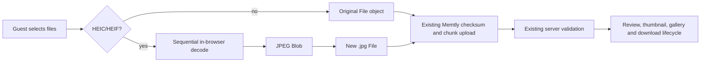

# Architecture

## Selected first approach

The first implementation inserts normalization immediately after the browser returns selected `File` objects and before Memtly computes checksums or chunks data.

## Invariants

1. The feature is disabled by default until validation is complete.
2. JPEG, PNG and video inputs are not re-encoded or renamed.
3. Detection uses content inspection with MIME and extension only as hints.
4. Conversion failure is terminal for that file; raw HEIC is not uploaded.
5. Conversion is sequential to bound browser memory.
6. Memtly's server allow-list continues to exclude `.heic` and `.heif`.
7. The overlay is pinned to exact upstream source and fails when its patch no longer applies.
8. Build and runtime dependencies are pinned and accompanied by provenance and license notices.

## Rejected first approaches

### Post-upload filesystem watcher

Memtly creates thumbnails and database metadata immediately after assembling uploaded chunks. Renaming or replacing files afterward can desynchronize title, checksum, size, media type, orientation, deletion, duplicate detection, and review behavior.

### Raw HEIC plus thumbnail only

A browser-compatible thumbnail does not make the full-size raw asset broadly displayable. It also leaves download/view semantics inconsistent.

### Server conversion as the first step

Server conversion is more consistent across clients but expands the trusted backend, image-decoder attack surface, container dependencies, concurrency controls, and metadata lifecycle. It remains a later option if browser conversion cannot meet capture-date requirements.
